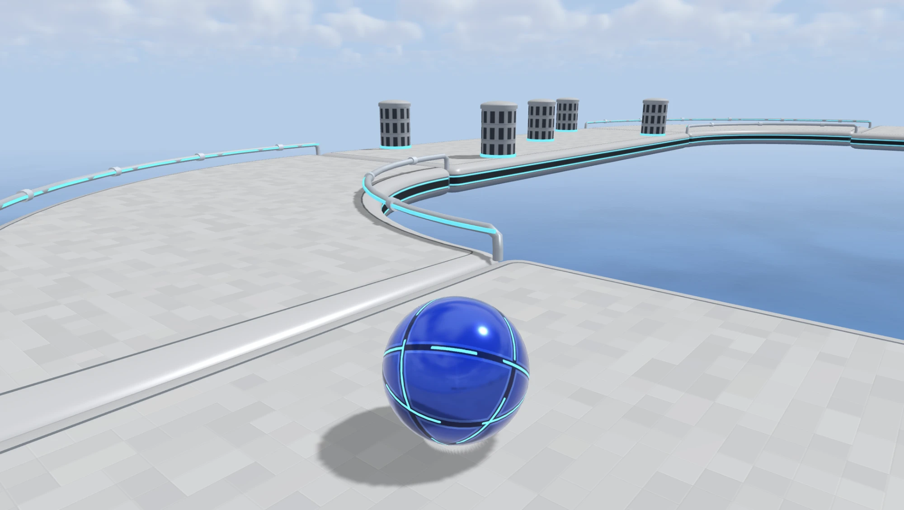
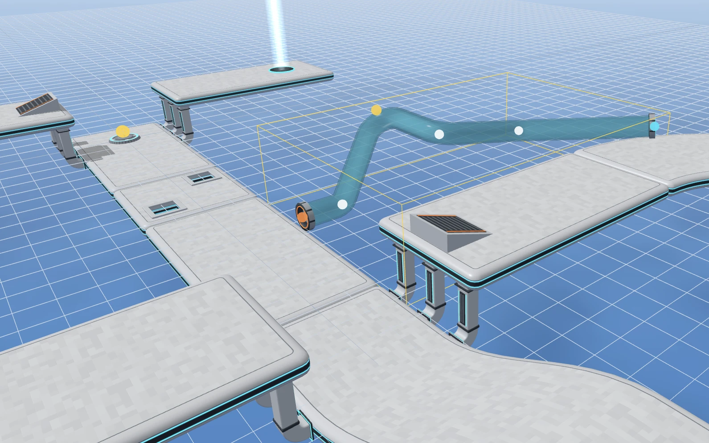

# Zoosky



Zoosky is my personal reimagination of the classic iOS 3D puzzle platformer game: Aerox. It began as Oxare, an anagram of the name, and became Zoosky once the levels filled with animals floating among the clouds. I loved how simple this game looks yet how deeply addictive and fun the puzzle solving process is. Unfortunately, the game stopped receiving new updates and the original 40 levels were not enough content for me. Thus, I rebuilt the game to the best of my ability on a new engine 10+ years later. Hope this is fun for someone.

## Features

In order of building:

- All 40 original levels completely rebuilt in the new level editor (currently working on).
- Brand new levels created by me, plus endless community created and voted levels.
- An editor for anyone to create any level.



## Run it yourself

```
git clone https://github.com/kennyzhang0819/zoosky.git
cd zoosky
npm install
npm run dev      # http://localhost:5173
npm run check    # typecheck + headless physics check of every level
npm run build    # static bundle in dist/
```
